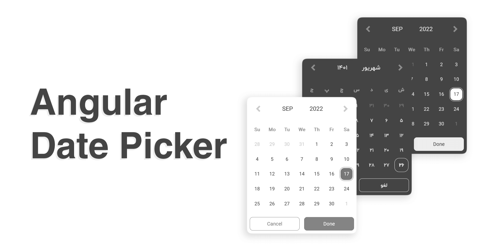

# Angular Date Picker


ngx-date-picker is a customizable jalali ( persian ) and gregorian date picker for Angular +12
## Demo: [ngx-date-picker](https://google.com)

## Install and Setup
### step 1: install @ah99/ngx-date-picker

```bash
npm i @ah99/ngx-date-picker
```
### step 2: Import NgxDatePickerModule to your module

```typescript
import { NgxDatePickerModule } from '@ah99/ngx-date-picker'

@NgModule({
    imports: [
        NgxDatePickerModule.forRoot() // dont forget forRoot()
    ]
})
```
### step 3: Import css styles to your global styles ( usually styles/.css/.scss/.less/ )
```css
  @import "@ah99/ngx-date-picker/styles"
```
## Use
use `ngx-date-picker` directive on any `html input element` you need
```html
  <input ngx-date-picker [(ngModel)]="dateControl">
```
**important**: you need to setup one form model in your input element with formControl or ngModel So you must have already imported **FormsModule** or **ReactiveFormsModule** in your module.

## Config
There are some options for config your date picker as below:

| Option | Type | Default | Description
| ------ | ---- | ------- | ----------
| calendar | "gregorian" \| "jalali" | "gregorian" | Type of your calendar
| format | [ValueFormat](#ValueFormat) | "DD/MM/YYYY" | Format of your input element value
| outputData | object | [Default OutputEvent Config](#OutputEventConfig) | These are the output values from the [onDateSelect]() event
| displayFooter | boolean | true | This option is for date picker action buttons. date picker will be closed immediately after selecting the date if this option set to false.
| doneText | string | "Done" | Done action text
| cancelText | string | "Cancel" | Done action text
| theme | "light" \| "dark" | "light | Date picker theme
| themeConfig | object | [Default Theme Config](#DefaultThemeConfig)

#### ValueFormat = "MM/DD/YYYY" | "MM-DD-YYYY" | "DD-MM-YYYY" | "DD/MM/YYYY"

#### OutputEventConfig
```javascript
outputData: {
  date: true, // boolean
  type: false, // boolean
  year: false, // boolean
  month: false, // boolean
  day: false // boolean
}
```
#### DefaultThemeConfig
```javascript
themeConfig: {
    light: {
        primaryColor: "#777777", // string
        secondaryColor: "#444444", // string
        backgroudColor: "#ffffff" // string
    },
    dark: {
        primaryColor: "#ffffff", //string
        secondaryColor: "#eeeeee", // string
        backgroudColor: "#444444" // string
    },
    rounded: "medium" // flase | "medium" | "full"
}
```